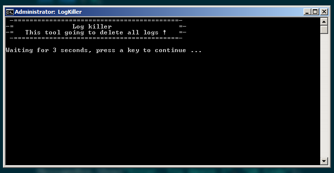
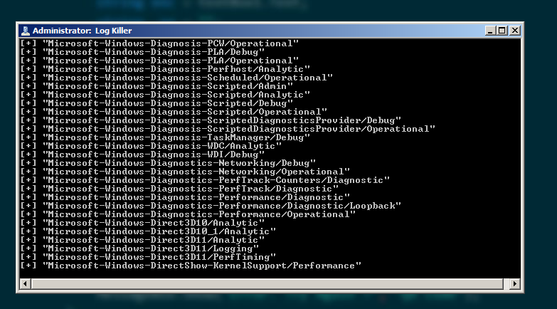
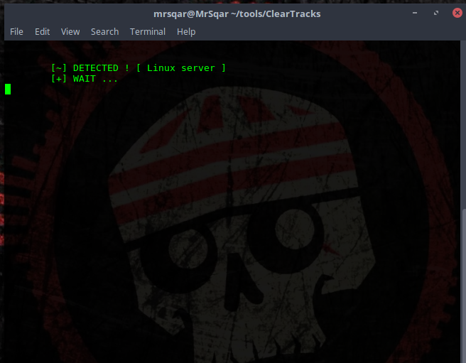
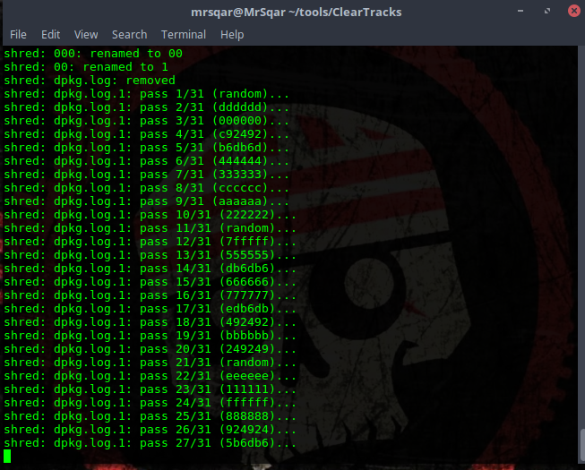
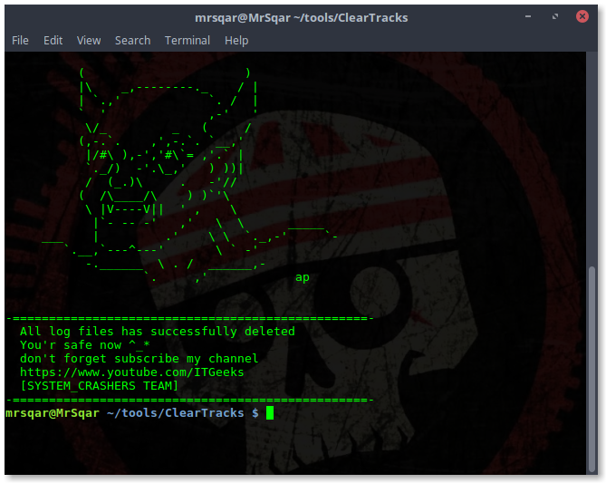
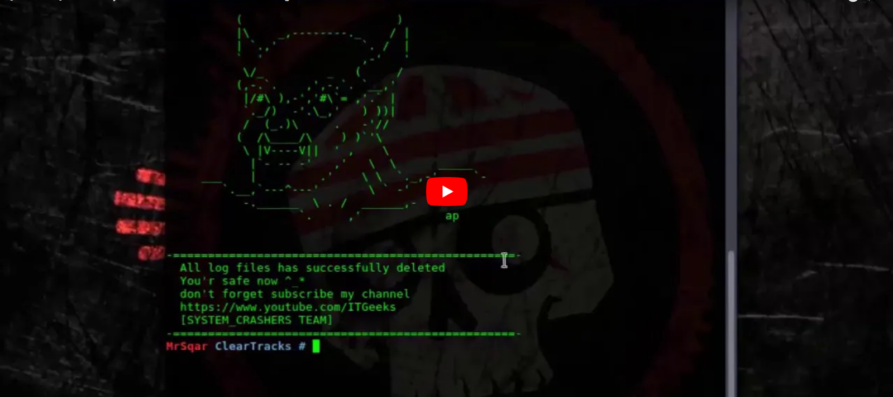

# Log-killer
<b>Log Killer is tool for [Linux/Windows] Servers 
This tool will delete all your logs 
just download the tool and run it on the server  
if your server OS is Windows then download the batch file and run it as administartor 
but if your server Linux 
Then you should run the php script </b>

# ScreenShots 
<b>Windows (batch file):</b> 

  
<b>Linux</b> : 

<h2>Video : </h2>
 
<h2> License </h2>
 
and special thanks to <a href="https://github.com/mrSqar-Ye">MrSqar</a>
